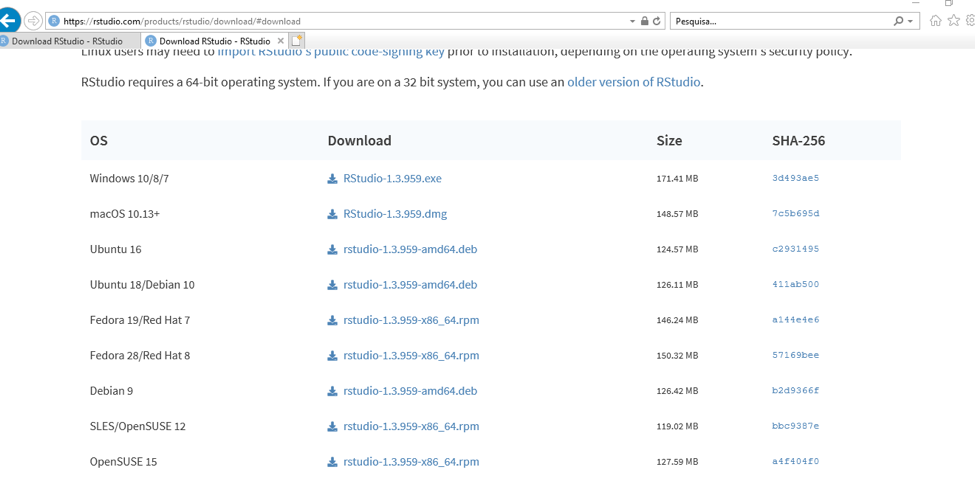

# Instalação do R

Para este tutorial, nós iremos instalar dois softwares: R e RStudio. Para utilizar o RStudio, é necessário primeiro instalar o R. 
  
Assim, siga os passos para instalação de acordo com o sistema operacional de seu computador.

## LINUX

### Instalar o R

* Passo 1: Abra o terminal. Se utilizar distribuição Fedora, pressione as teclas Super + T, e no Ubuntu Ctrl + Alt + t;  
* Passo 2: Com o terminal aberto digite a seguinte linha de comando:
  + Fedora: `sudo dnf install R`
  + Ubuntu: `sudo apt-get install r-base r-base-core`  
* Passo 3: Pressione a tecla Enter para confirmar;     
* Passo 4: Colocar a senha do usuário;   
* Passo 5: Confirmar. O R estará instalado e pode ser acessado.

Link para eventual consulta: [http://cran-r.c3sl.ufpr.br/bin/linux/](http://cran-r.c3sl.ufpr.br/bin/linux/)

### Instalar o RStudio

* Passo 1: Acesse o site [https://rstudio.com/products/rstudio/download/](https://rstudio.com/products/rstudio/download/)  
* Passo 2: Encontre na página o local de download gratuito conforme figura abaixo:

```{r img1, echo=FALSE}

```

* Passo 3: Encontre o sistema operacional do seu computador (Ubuntu, Fedora, Debian ou OpenSUSE) e faça download.  
* Passo 4: Acesse o terminal na pasta onde foi feito o download e siga as instruções abaixo usando Fedora ou Ubuntu:  
  + Fedora: `sudo dnf install nomedo_arquivo_baixado.rpm`; Ex: `sudo dnf install rstudio-1.3.959-x86_64.rpm` 
  + Ubuntu: `sudo dpkg -i nomedo_arquivo_baixado.deb`  
* Passo 5: Após isso, o RStudio estará instalado no seu computador e pronto para uso.  

## Mac OS X

### Instalar o R

* Passo 1: Abra o site [CRAN - https://cran.r-project.org/](https://cran.r-project.org/)
* Passo 2: Clique em Download de R for (Mac) OS X.   
* Passo 3: Clique duas vezes no arquivo depois de baixado que será instalado no seu computador.   

### Instalar o RStudio

* Passo 1: Acesse o site [https://rstudio.com/products/rstudio/download/](https://rstudio.com/products/rstudio/download/)    
* Passo 2: Encontre na página o local de download gratuito conforme figura abaixo:  
  
```{r img2, echo=FALSE}

```

* Passo 3: Encontre o sistema operacional do seu computador (Mac OS) e faça download.  
* Passo 4: Depois de baixado, clique duas vezes no arquivo para instalá-lo. Após, estará pronto para uso.  

## Windows  
### Instalar o R

* Passo 1: Clique no seguinte link [https://cran.r-project.org/bin/windows/base/]( https://cran.r-project.org/bin/windows/base/)   
* Passo 2: Clique em Download R for Windows (os números que aparecem nesse arquivo de download correspondem à versão do R disponível):

```{r img3, echo=FALSE}
knitr::include_graphics("img/inst_1_rwindows.png")
```

* Passo 3: Clique duas vezes no arquivo depois de baixado, clique em avançar até finalizar a instalação que será instalado no seu computador.   

### Instalar o RStudio

* Passo 1: Acesse o site [https://rstudio.com/products/rstudio/download/](https://rstudio.com/products/rstudio/download/)  
* Passo 2: Encontre na página o local de download gratuito conforme figura abaixo:

```{r img4, echo=FALSE}

```

* Passo 3: Encontre o sistema operacional do seu computador (Windows) e faça download.
* Passo 4: Depois de baixado, clique duas vezes no arquivo para instalá-lo. Após, estará pronto para uso.

## Criando um projeto no RStudio

Feitas as instalações, podemos começar a trabalhar com o R e RStudio. Uma forma prática de iniciar o trabalho com o RStudio é usando projetos.

Para iniciar um novo projeto, acesse o menu "File > New Project", ou então o ícone na parte superior direita do RStudio. O RStudio vai perguntar se você quer criar um novo diretório para o projeto, usar um diretório existente, ou ainda clonar um repositório distante (GitHub por exemplo). 

Para criar o novo diretório, basta informar o diretório onde será criado o diretório do projeto e o nome do novo diretório onde todos os documentos do projeto serão armazenados.

Ao fechar o RStudio, todos os documentos e objetos no ambiente serão salvos no projeto e você pode retomar o trabalho de onde parou (salvo as bibliotecas, que tem que ser recarregadas a cada nova seção do R!).

